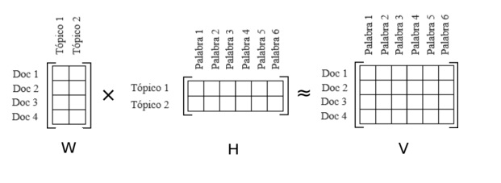
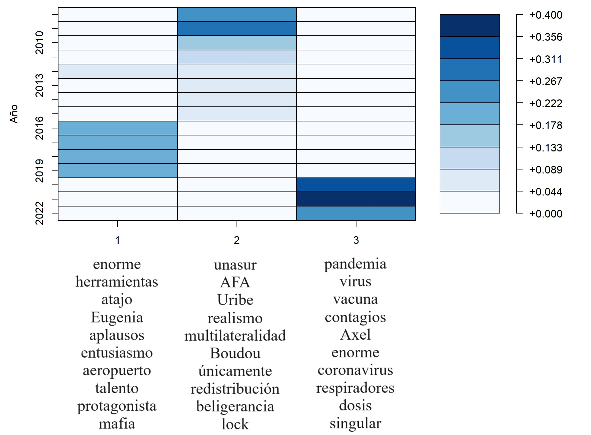
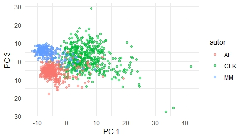
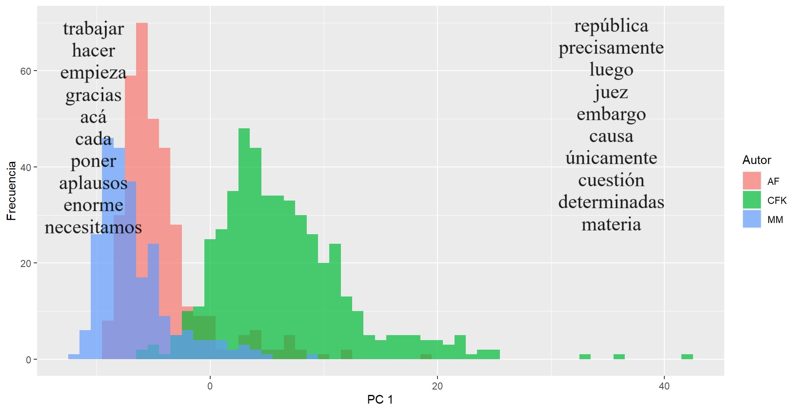
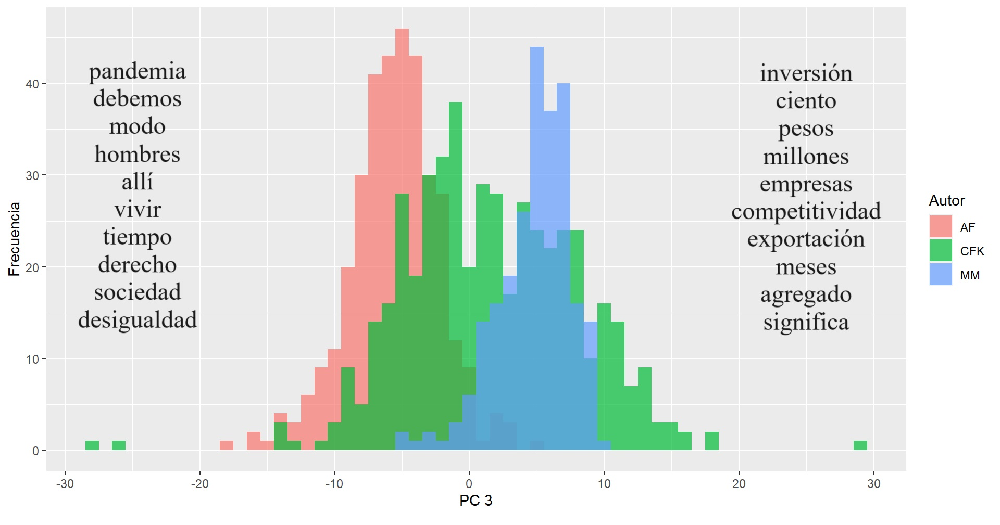

# Analisis-Discursos-Presidenciales

Aquí presentamos los resultados de la tesis ["Técnicas matriciales para el análisis y clasificación de discursos presidenciales" ](https://github.com/ianbounos/analisis-discursos-presidenciales/blob/main/Tesis%20t%C3%A9cnicas%20matriciales%20para%20la%20clasificaci%C3%B3n%20de%20discursos%20presidenciales.pdf), en la cual se aplican técnicas de reducción de la dimensión para el análisis semántico y de tópicos de discursos de los presidentes Alberto Fernández, Mauricio Macri y Cristina Fernández de Kirchner entre 2008 y 2022. Los discursos fueron obtenidos por scraping, los textos crudos pueden encontrarse en  [textos.zip](https://github.com/ianbounos/analisis-discursos-presidenciales/blob/main/textos.zip), el script de python para obtenerlos en  [scrapper casa rosada.py](https://github.com/ianbounos/analisis-discursos-presidenciales/blob/main/scraper%20casa%20rosada.py). Finalmente una versión ya procesada del texto sin stopwords ni textos en inglés en formato tidy de R puede encontrarse en [tidy_autores2.RDS](https://github.com/ianbounos/analisis-discursos-presidenciales/blob/main/tidy_autores2.RDS). Esta versión tiene 612953 filas con:

* *term:* termino
* *total_count:* cantidad de veces que aparece el término en todos los textos.
* *autor:* presidente que enunció el discurso.
* *año:* año en que se enunció el discurso.
* *numero:* identificador de discurso.
* *count:* cantidad de veces que aparece el término en dicho discurso.
* *term_lematizado:* versión lematizada del término.

En [Implementación Codigo.R](https://github.com/ianbounos/analisis-discursos-presidenciales/blob/main/Implementaci%C3%B3n%20c%C3%B3digo.R) puede el script que generó los resultados de la tesis. 

# NMF

La descomposición de matrices no negativas (NMF, por sus siglas en inglés) es una técnica utilizada en el análisis de texto para identificar patrones subyacentes y estructuras temáticas. La NMF descompone una matriz de frecuencia término-documento en dos matrices no negativas más pequeñas: una matriz de características latentes (H) y una matriz de coeficientes (W) que indican la importancia de esos temas en cada documento. Lo aplicamos sobre la matriz de frecuencias y tf idf realizada con base en tidy_autores. Esta sección y la siguiente son informales y los detalles técnicos pueden encontrarse en la tesis.

En algún sentido, la matriz W comprime información en una versión de la matriz original de menos columnas. Por ejemplo, en un análisis anualizado haciendo pesos TF IDF en la matriz original, cada fila de la matriz representa un año. Si graficamos visualmente la matriz W vemos como nos segmenta períodos presidenciales de manera muy marcada. Debajo, pueden verse la palabras de mayor preponderancia para cada presidente. 

Si hacemos una matriz discurso por discurso, la reducimos de 9272 columnas a 4 y a esa versión reducida la usamos para entrenar un algoritmo KNN obtenemos la siguiente matriz de confusión hecha con cross validation de 5 pliegues para evitar sobreajuste:

|                   | CFK | MM  | AF  |
|-------------------|-----|-----|-----|
| Predicho CFK      | 457 | 21  | 25  |
| Predicho MM       | 9   | 219 | 5   |
| Predicho AF       | 17  | 2   | 318 |

Esto implica una tasa de aciertos del 92.6%.

# PCA

Si a la matrz tf idf hecha con base en tidy_autores le aplicamos PCA podemos visualizar. La mejor segmentación se hace con la primer componente vs la tercera:

Si hacemos el histograma de la PC1 vemos que separa textos de CFK vs textos que no son de CFK. Podemos ver las palabras de mayor score en valor absoluto que identifican ambos casos:

Replicamos el proceso con la PC3 que diferencia a Alberto Fernández de Mauricio Macri.

En este caso, la matriz de confusión implica una tasa de aciertos del 98%:

|                   | CFK | MM  | AF  |
|-------------------|-----|-----|-----|
| Predicho CFK      | 474 | 2   | 6   |
| Predicho MM       | 2   | 238 | 2   |
| Predicho AF       | 7   | 2   | 340 |

